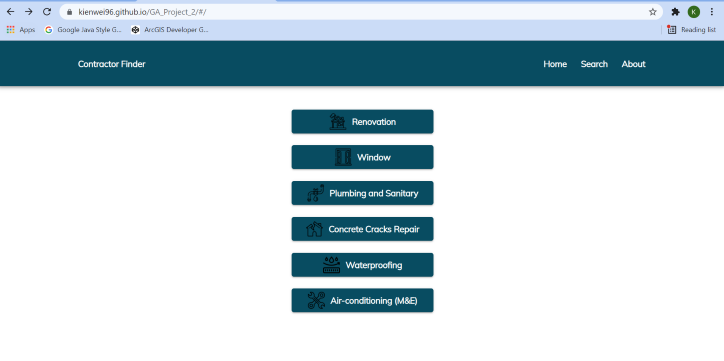

# Contractor Finder
Contractor Finder is an application built using ReactJS that compiles all the contractor data which recognized by HDB and BCA in Singapore. There are two main function of this app where user can either look for the contractor information by categories or search by company details (name or UEN no.).

## About
The objective of this application is to allow users to look for contractor by categories or to check/verify the contractor is recognized by HDB and BCA in Singapore for their HDB renovation or maintenance works.

## Technologies
This site was created using ReactJS
 
**Maps**: Esri ArcGIS WebMap

**Tables**: material-table  

**Styling**: Material-UI  

_Contractor data from data.gov.sg API_  
_Geocoding and maps from ArcGIS API for JavaScript_

## APIs
https://data.gov.sg/dataset/listing-of-registered-renovation-contractors (HDB Directory of Renovation Contractors)
https://data.gov.sg/dataset/listing-of-registered-contractors (BCA Registered Contractor)
https://developers.arcgis.com/javascript/latest/find-places/ (ArcGIS display map and geocoding)

## User Story
1) User will be able to choose the categories of contractor via the first loaded page
2) User will be able to click on the Search button in the navbar to link to the search component
3) Within the search component, the user will be able to search for the specific contractors
4) The user will be able to double click on each contractor which display in the table row to view more information about the company such as contact number, email address, workhead, grade, license expiry date and location on the map.

## Wireframes

Home Component
  

 

Search Component  

 

Information Component  
